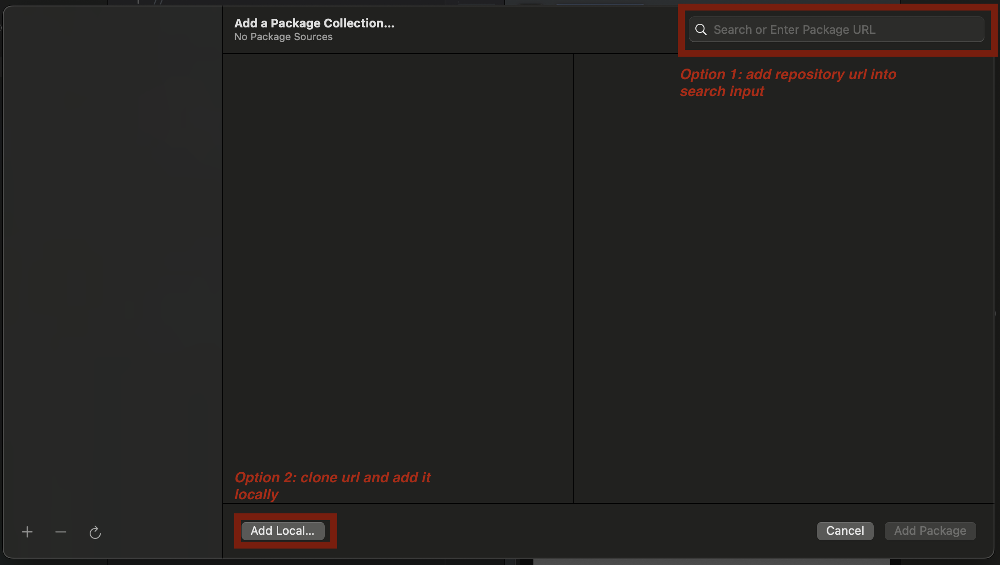
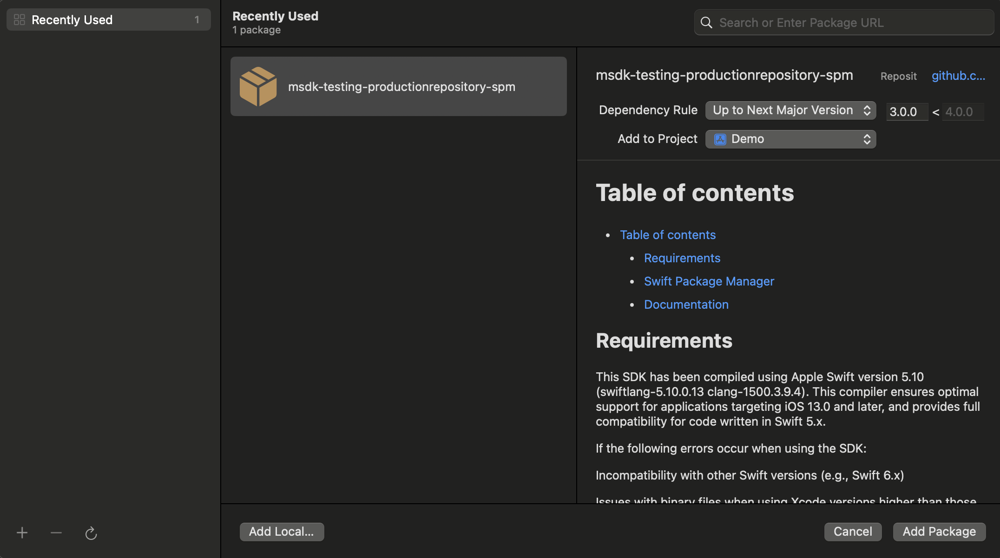
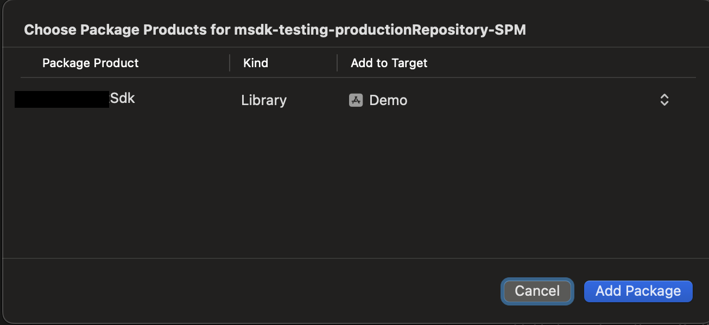
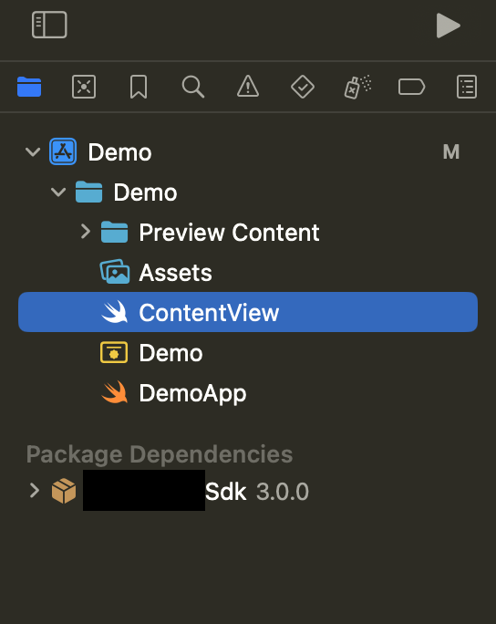

# Table of contents

- [Table of contents](#table-of-contents)
  - [Requirements](#requirements)
  - [How to Add the Package to Your Xcode Project](#how-to-add-the-package-to-your-xcode-project)
  - [Documentation](#documentation)

## Requirements

This SDK has been compiled using Apple Swift version 6.0.3 (swiftlang-6.0.3.1.10 clang-1600.0.30.1). This compiler ensures optimal support for applications targeting iOS 13.0 and later, and provides full compatibility for code written in Swift 6.x.

If the following errors occur when using the SDK:

Incompatibility with other Swift versions (e.g., Swift 5.x)

Issues with binary files when using Xcode versions lower than those supported by Swift 6

we recommend switching to CocoaPods for proper SDK integration, where a stable version compatible with newer Swift versions or Xcode will be used. You can find Cocoapod version here [Cocoapod repository](https://github.com/PLACEHOLDER_COCOAPOD_PRODUCTION_URL)

## How to Add the Package to Your Xcode Project

1. Open your project in **Xcode**.
2. Go to the menu bar and select **File** → **Add Package Dependencies...**
3. In the dialog that appears, you can choose between two options:

   - **Option 1**: Let Xcode fetch the package directly from the repository.
     - Enter the repository URL in the search field:  
       `https://github.com/SPM_PLACEHOLDER_PRODUCTION_REPO_URL`
   - **Option 2**: Clone the repository manually and add it as a **local package**.

   

4. After selecting the package, click **Add Package**.  
   

5. Choose the appropriate target for the package and press **Add Package**.  
   

6. The new package will now be added to your project.  
   

## Documentation

- [API Reference](./docs/api-reference.md)
- [Integration](./docs/integration.md)
- [Theming](./docs/theming.md)
- [Apple Pay](./docs/apple-pay.md)
- [Troubleshooting](./docs/troubleshooting.md)
